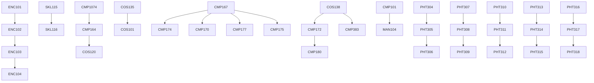

# 🏆 YouthDev Application Development with Generative AI Contest 2023
YouthDev-ADGAIC-2023 - [Tiếng Việt](https://github.com/hutechbmtoan/youthdev-generative-ai-contest-2023/blob/main/README-vi.md)


## 🚀 Contest Overview

Welcome to the Application Development with Generative AI Contest! This contest challenges participants to develop innovative applications using Generative AI techniques. Put your skills to the test and showcase your creativity in building AI-powered applications.

## 📝 Contest Details
- **Eligibility**: ***All HUTECH university*** students from all faculties and departments are eligible to participate.
- **Objective**: Develop an application ***(not just prompt chat messages)*** that utilizes Generative AI techniques to create novel and unique outputs.
- **Programming Languages**: Participants can use ***any programming language or framework*** of their choice.
- **Dataset**: We provide a sample dataset for testing below.
- **Deadline**: Submissions must be made by ***the end of August 10, 2023, local time in Vietnam (23:59 GMT+7).***

## 💡 Contest Guidelines

Participants must adhere to the following guidelines:

- Participants must adhere to ethical guidelines and avoid using offensive or harmful content.
- Submissions should include:
  1. A **working application** (.zip file).
  2. A **brief documentation** describing the application (.pdf file).
  3. The **share link** (e.g., https://chat.openai.com/share/ee4ccbfd-699b-4e0d-a6e4-a427417d1d04).
- Make sure your code is well-structured, documented, and follows best practices.
- All submissions will be evaluated based on creativity, functionality, and the overall user experience.

## 🎯 Contest Tasks

Participants are required to complete the following tasks:

1. Utilize a Generative AI tool, such as ***ChatGPT***, to create an application that can read Excel/PDF files and write Mermaid code.
2. Implement the Generative AI model into a functional *(may use console)* application.
3. Showcase the application's capabilities by ***generating Mermaid diagrams*** based on user input (Excel/PDF file).
4. Write a documentation file describing the application, its features, and the process of generating Mermaid diagrams.
5. Submit the documentation file along with the application.

## 📂 Sample Files and Target Result

- We provide the following sample files for input and testing your application:
  - [Sample Excel File](./sample_data.xlsx)
  - [Sample PDF File](./sample_data.pdf)
  - [Another Sample Files](https://www.hutech.edu.vn/daotao/ke-hoach-dao-tao/91386-noi-dung-chuong-trinh-dao-tao-dai-hoc-chinh-quy-khoa-2022)

- Example target result:
  - [Sample target result](./sample_target_result.pdf)
  - This example is provided for illustrative purposes only. The actual target result will be evaluated based on the contest criteria.
```
graph TD
    ENC101 --> ENC102
    ENC102 --> ENC103
    ENC103 --> ENC104
    SKL115 --> SKL116
    CMP1074 --> CMP164
    CMP164 --> COS120
    COS135 --> COS101
    CMP167 --> CMP174
    CMP172 --> CMP180
    CMP167 --> CMP170
    CMP167 --> CMP177
    CMP167 --> CMP175
    COS138 --> CMP172
    CMP101 --> MAN104
    COS138 --> CMP383
    PHT304 --> PHT305
    PHT305 --> PHT306
    PHT307 --> PHT308
    PHT308 --> PHT309
    PHT310 --> PHT311
    PHT311 --> PHT312
    PHT313 --> PHT314
    PHT314 --> PHT315
    PHT316 --> PHT317
    PHT317 --> PHT318
```

[Live Editor](https://mermaid.live/edit#pako:eNp10sFqwzAMBuBXCT63YNlJ7OUwGO1gsKUrpMdcTO2tgSUpwTmM0nefG2eRBp1PPx_CSEIXduytYwX7HMz5lBy2dZeE97zbAIdkvX6MURAWyJKwRE4jV69vANnEU8wjb8o9cJVOfst5ip7P_F6B4DOHLLOFOZBqtXyiyCdKLKz5_ep_WN3njHSikQWZJ-6qfNot0_-tlnre1f7lIHmccooZ4Qw5J6yQNWGN_IAMfGEAwoAsCEvklDA2CKRByJEVYWwQNFux1g2taWw4qsutqGb-5FpXsyJE6z7M-OVrVnfXUGpG31ff3ZEVfhjdio1na7zbNiacY_uLzja-H8p4p9O5Xn8A8Vmn6w)


- Example console application output:
[](sample_console_application_output.jpg)
  
## 🏅 Prizes

- 1st Place: 500,000 VND
- 2nd Place: 400,000 VND
- 3rd Place (First Runner-up): 300,000 VND
- 3rd Place (Second Runner-up): 200,000 VND

## 📬 Submission

To participate in the contest, follow these steps:

1. Develop your ***application*** and create a ***documentation file*** describing the application and the process of generating Mermaid diagrams.
2. Wrap both the application code and the documentation file into a ***single zip file***. *Without packages, node_module or libraries folder.*
3. Upload the zip file and share the ChatGPT link using the provided Google Form: [Submission Form Link](https://forms.gle/Dv7qbswr1i4TxGnT8). (Please make sure the file size is below 100MB.)
4. Submit the form by **August 10, 2023, local time in Vietnam (23:59 GMT+7)**.

## ❓ Questions and Support

For any questions or any support, please contact me via: hieuliem201@hutech.edu.vn or visit https://www.facebook.com/hieuliempham.


