# 🏆 YouthDev Application Development with Generative AI Contest 2023
YouthDev-ADGAIC-2023


## 🚀 Giới thiệu

Ứng dụng Mermaid là một script Python cho phép bạn tạo ra các biểu đồ Mermaid từ các tệp Excel hoặc PDF chứa dữ liệu về các học phần tiên quyết và song hành. Làm theo hướng dẫn dưới đây để sử dụng ứng dụng một cách hiệu quả.

## 📝 Cài đặt thư viện
Trước khi sử dụng Ứng dụng Mermaid, hãy đảm bảo bạn có những điều sau:
•	Python đã được cài đặt trên máy tính của bạn (phiên bản 3.x được khuyến nghị).
•	Các gói Python cần thiết: pandas, tabula-py, camelot, graphviz. Bạn có thể cài đặt chúng bằng lệnh pip:
```
pip install pandas tabula-py camelot-py[cv] graphviz
```


## 💡 Chạy Chương trình

Để chạy Ứng dụng Mermaid, làm theo các bước sau:
1.	Mở cửa sổ dòng lệnh hoặc terminal.
2.	Điều hướng đến thư mục chứa tệp script (mermaid_app.py).
3.	Chạy script bằng lệnh sau:
```
python mermaid_app.py <đường_dẫn_tệp>
```
Thay thế <đường_dẫn_tệp> bằng đường dẫn đến tệp Excel hoặc PDF chứa dữ liệu học phần.
4.	Script sẽ tạo ra một biểu đồ Mermaid dựa trên tệp được cung cấp và hiển thị mã của biểu đồ trong cửa sổ console.


## 🎯 Các Hàm trong Chương trình

Ứng dụng Mermaid cung cấp các hàm sau:
**read_data(đường_dẫn_tệp)**
Hàm này đọc dữ liệu học phần từ tệp Excel hoặc PDF và trả về một pandas DataFrame.
•	đường_dẫn_tệp (str): Đường dẫn đến tệp đầu vào.
Trả về:
•	df (pandas DataFrame): DataFrame chứa dữ liệu học phần.
**generate_mermaid_diagram(data)**
Hàm này tạo ra một biểu đồ Mermaid dựa trên dữ liệu học phần.
•	data (pandas DataFrame): DataFrame chứa dữ liệu học phần.
Trả về:
•	diagram (str): Mã của biểu đồ Mermaid.
**get_node_color(tên_nút, color_map)**
Hàm này tạo ra một màu ngẫu nhiên cho nút dựa trên tiền tố tên của nút.
•	tên_nút (str): Tên của nút.
•	color_map (dict): Một từ điển lưu trữ ánh xạ màu cho các tiền tố nút.
Trả về:
•	color (str): Mã màu được tạo ra cho nút.
**main()**
Hàm chính của script. Nó xử lý các đối số dòng lệnh, đọc tệp đầu vào, tạo biểu đồ Mermaid và in ra console.


## Kết quả thực nghiệm

```
graph TD
    ENC101((ENC101)) -->|Tien Quyet| ENC102((ENC102))
    style ENC101 fill:#DA158A,stroke:#333,stroke-width:4px
    style ENC102 fill:#DA158A,stroke:#333,stroke-width:4px
    classDef ENC101Class fill:#DA158A,stroke:#333,stroke-width:4px
    class ENC101 ENC101Class
    classDef ENC102Class fill:#DA158A,stroke:#333,stroke-width:4px
    class ENC102 ENC102Class
    ENC102((ENC102)) -->|Tien Quyet| ENC103((ENC103))
    style ENC102 fill:#DA158A,stroke:#333,stroke-width:4px
    style ENC103 fill:#DA158A,stroke:#333,stroke-width:4px
    classDef ENC102Class fill:#DA158A,stroke:#333,stroke-width:4px
    class ENC102 ENC102Class
    classDef ENC103Class fill:#DA158A,stroke:#333,stroke-width:4px
    class ENC103 ENC103Class
    .......
    .......
    PHT317((PHT317)) -->|Tien Quyet| PHT318((PHT318))
    style PHT317 fill:#602A51,stroke:#333,stroke-width:4px
    style PHT318 fill:#602A51,stroke:#333,stroke-width:4px
    classDef PHT317Class fill:#602A51,stroke:#333,stroke-width:4px
    class PHT317 PHT317Class
    classDef PHT318Class fill:#602A51,stroke:#333,stroke-width:4px
    class PHT318 PHT318Class
```

[Live Editor](https://mermaid.live/view#pako:eNrNm1FP20gQx78Kcl9AAuTZXe-u83AShaJKd7Q9wdOJl4i4gAoJCkFXDvrdb-2dhHE8qbCHOPBiY-_-_-sfo_XMWDwlF5NRkQySy-nw7mrr7Oh8vBV-Pn05hBS2t-NxZ2drb--P57PrYrz198NjMXuOAxQOUDs7cdr97PGmwMlb369vbgYfPh1nxzrfvZ9NJz-KwQetNZ7v_Xs9ml0NzN3PxlzVdu7FzfD-_qj4jtaH5a-dNOZrJzqcg5I6KKpDkBOiPHKNAzSDXAmQaxnydQCpO2ipg6Y6BDkhyiM3OMAwyLUAuZEhXweQuoOROhiqE--e_vkXQLa9HY8M8uqGxQG2jjxOwgWBP_bpx1cjj3pt5y6ARGsKpJ3GfO1Eh3OwUgdLdeLdw5NvkLoQxXjCQC_vWBxhl-IcZ-GaDg6tOno99SjYdu6CCXpTKO1EFqunSoyJlXpYQ3VewFOqTexfT0GlYUB1bGK3XalXejjX-6PjY9WW-lqAvDhUC6QO7VY5f0Kig8jDBZ1FojpbgbxMbOJxCXk1qe2CXuYucp4OyCtrIZCwdqLDONQzow4O4QmJDolyh1HuVmwu8-3HMZuLdd33FifbW6yTRrmjOoyDePPCvcstbyxOIVG1ArlP4wDPbCxOdUfuUxFyp6RAFNVhHHwqdAhPSHTaRDkid-kbR3n63qNcitylVKcNchzg3Bsjd-8dudTBOarTBnmGyLM3Rp69d-SZFHlGdUjG4jFj8auQk82-kbH4jhlLp_dAPWPx0ozFU52-3hZVLQBYD3HNrZODL1XZH49MOQTdojzq4dyPHtzhQetqCKTFEFCdJYe4QOrQbpXzJyQ6r49y7XX1NwnHN43yoPe-ozwsUPZHLZ-Q6JAkkaTdAfne8-lkfLn1eTi-QuIKiatGkIdrm0rLg7WUh6I6vaXlS-V8g_jXU61i7RmOjRgP17rXnpJyv7KWxXi5dqKzwXK_SVwjcc0Q192Jt-8U1IlrKXFNdfrqJzAbeYM4xPvh2CQOXkDci4iDcB8v1050-npTVBccEncriOdIPGeI5wLiTkY8lxLPqQ5H3EmJO6rzm4Z5492ZYh1UnjTfnmn7akbUbq-9P1NppVItnyr12JdnuuYN9hbRW4a8zTb1qSJYC7HbjOr0-p2iXvU3iXsk7hniXkDcyYh7KXFPdfpqKyz3Z9ncHDA3ByY3h031b4O1NDcHqtNn_5a2ZzniDok7hriDTbVvg7WQuAOq02f7lrYKWeIWiVuGuN1UKzFYS4lbqtNnK_G39Wf5QgeDWQsYJmuBjX1xLr2lSQuYmlJvVWjzc1wz0rG35TQT6VoQ6UoW6dLOk9NUp7cObpmyW6yJ7Ir3J-aInskRfdY9zLUVhbmX5og-ozpcTWSlNZGlOiRjwazcr6qIqjI0nnB7Sy5IWoQFUb0S7bS35DUlLm-R5ubeUJ1XRnrZAjLY4TJMh8sIqn8r63AZaYfLUJ2-Iv3b5zNdfvyJR-ZTRXUjwwFLm0uchAtyKoP8-NXIo17buQsg0ZoCaacxXzvR4RwyqUNGdQhyQpRHbnGAZZBnAuRWhnwdQOoOVupgqQ5B7pCoW4Xc4wDPIHcC5F6G3EmBOKrDOXipg6c6BDkhyiPPcUDOIPcC5LkM-TqA1B1yqUNOdV6QQxqJQroCOQAOgCZySLsjBxAhh1QIJKyd6HAOIHUAqkOQE6I8coUDFIMcBMiVDPk6gNQdlNRBUR2CXCNRvQo5pjTLZX-cJEBuZMi1FIimOpyDNCcCQ3UIckKUR44pDTBJIgiSRJAliWsBUneQ5kSQUR2CHHNAsKuQY0oDjkFuBcidDLk0hQNLdTgHaU4EjuoQ5IQojxxTGmCSRBAkiSBLEtcCpO4gzYnAU51kN7ktprfD61EySJ7KsefJ7Kq4Lc6TQTgdDac_zpPz8a8wbvgwm5w-ji-SwWz6UOwmD3ej4aw4uh5eToe384vF6Ho2mZ7E_-6t_sl3N7kbjv-ZTBZDwq_J4Cn5mQxA2X1twRptrMtTbbPd5DFcNn5fWZ-F2kHbPAOT_dpN_qsU0n2fOevA6NyacGLsr_8BcQcw0A)

```mermaid
graph TD
    ENC101((ENC101)) -->|Tien Quyet| ENC102((ENC102))
    style ENC101 fill:#EF5F39,stroke:#333,stroke-width:4px
    style ENC102 fill:#EF5F39,stroke:#333,stroke-width:4px
    classDef ENC101Class fill:#EF5F39,stroke:#333,stroke-width:4px
    class ENC101 ENC101Class
    classDef ENC102Class fill:#EF5F39,stroke:#333,stroke-width:4px
    class ENC102 ENC102Class
    ENC102((ENC102)) -->|Tien Quyet| ENC103((ENC103))
    style ENC102 fill:#EF5F39,stroke:#333,stroke-width:4px
    style ENC103 fill:#EF5F39,stroke:#333,stroke-width:4px
    classDef ENC102Class fill:#EF5F39,stroke:#333,stroke-width:4px
    class ENC102 ENC102Class
    classDef ENC103Class fill:#EF5F39,stroke:#333,stroke-width:4px
    class ENC103 ENC103Class
    ENC103((ENC103)) -->|Tien Quyet| ENC104((ENC104))
    style ENC103 fill:#EF5F39,stroke:#333,stroke-width:4px
    style ENC104 fill:#EF5F39,stroke:#333,stroke-width:4px
    classDef ENC103Class fill:#EF5F39,stroke:#333,stroke-width:4px
    class ENC103 ENC103Class
    classDef ENC104Class fill:#EF5F39,stroke:#333,stroke-width:4px
    class ENC104 ENC104Class
    SKL115((SKL115)) -->|Tien Quyet| SKL116((SKL116))
    style SKL115 fill:#18F80B,stroke:#333,stroke-width:4px
    style SKL116 fill:#18F80B,stroke:#333,stroke-width:4px
    classDef SKL115Class fill:#18F80B,stroke:#333,stroke-width:4px
    class SKL115 SKL115Class
    classDef SKL116Class fill:#18F80B,stroke:#333,stroke-width:4px
    class SKL116 SKL116Class
    CMP1074((CMP1074)) -->|Tien Quyet| CMP164((CMP164))
    style CMP1074 fill:#AC62DB,stroke:#333,stroke-width:4px
    style CMP164 fill:#AC62DB,stroke:#333,stroke-width:4px
    classDef CMP1074Class fill:#AC62DB,stroke:#333,stroke-width:4px
    class CMP1074 CMP1074Class
    classDef CMP164Class fill:#AC62DB,stroke:#333,stroke-width:4px
    class CMP164 CMP164Class
    CMP164((CMP164)) -->|Tien Quyet| COS120((COS120))
    style CMP164 fill:#AC62DB,stroke:#333,stroke-width:4px
    style COS120 fill:#88DFF2,stroke:#333,stroke-width:4px
    classDef CMP164Class fill:#AC62DB,stroke:#333,stroke-width:4px
    class CMP164 CMP164Class
    classDef COS120Class fill:#88DFF2,stroke:#333,stroke-width:4px
    class COS120 COS120Class
    COS135((COS135)) -->|Tien Quyet| COS101((COS101))
    style COS135 fill:#88DFF2,stroke:#333,stroke-width:4px
    style COS101 fill:#88DFF2,stroke:#333,stroke-width:4px
    classDef COS135Class fill:#88DFF2,stroke:#333,stroke-width:4px
    class COS135 COS135Class
    classDef COS101Class fill:#88DFF2,stroke:#333,stroke-width:4px
    class COS101 COS101Class
    CMP167((CMP167)) -->|Tien Quyet| CMP174((CMP174))
    style CMP167 fill:#AC62DB,stroke:#333,stroke-width:4px
    style CMP174 fill:#AC62DB,stroke:#333,stroke-width:4px
    classDef CMP167Class fill:#AC62DB,stroke:#333,stroke-width:4px
    class CMP167 CMP167Class
    classDef CMP174Class fill:#AC62DB,stroke:#333,stroke-width:4px
    class CMP174 CMP174Class
    CMP172((CMP172)) -->|Tien Quyet| CMP180((CMP180))
    style CMP172 fill:#AC62DB,stroke:#333,stroke-width:4px
    style CMP180 fill:#AC62DB,stroke:#333,stroke-width:4px
    classDef CMP172Class fill:#AC62DB,stroke:#333,stroke-width:4px
    class CMP172 CMP172Class
    classDef CMP180Class fill:#AC62DB,stroke:#333,stroke-width:4px
    class CMP180 CMP180Class
    CMP167((CMP167)) -->|Tien Quyet| CMP170((CMP170))
    style CMP167 fill:#AC62DB,stroke:#333,stroke-width:4px
    style CMP170 fill:#AC62DB,stroke:#333,stroke-width:4px
    classDef CMP167Class fill:#AC62DB,stroke:#333,stroke-width:4px
    class CMP167 CMP167Class
    classDef CMP170Class fill:#AC62DB,stroke:#333,stroke-width:4px
    class CMP170 CMP170Class
    CMP167((CMP167)) -->|Tien Quyet| CMP177((CMP177))
    style CMP167 fill:#AC62DB,stroke:#333,stroke-width:4px
    style CMP177 fill:#AC62DB,stroke:#333,stroke-width:4px
    classDef CMP167Class fill:#AC62DB,stroke:#333,stroke-width:4px
    class CMP167 CMP167Class
    classDef CMP177Class fill:#AC62DB,stroke:#333,stroke-width:4px
    class CMP177 CMP177Class
    CMP167((CMP167)) -->|Tien Quyet| CMP175((CMP175))
    style CMP167 fill:#AC62DB,stroke:#333,stroke-width:4px
    style CMP175 fill:#AC62DB,stroke:#333,stroke-width:4px
    classDef CMP167Class fill:#AC62DB,stroke:#333,stroke-width:4px
    class CMP167 CMP167Class
    classDef CMP175Class fill:#AC62DB,stroke:#333,stroke-width:4px
    class CMP175 CMP175Class
    COS138((COS138)) -->|Tien Quyet| CMP172((CMP172))
    style COS138 fill:#88DFF2,stroke:#333,stroke-width:4px
    style CMP172 fill:#AC62DB,stroke:#333,stroke-width:4px
    classDef COS138Class fill:#88DFF2,stroke:#333,stroke-width:4px
    class COS138 COS138Class
    classDef CMP172Class fill:#AC62DB,stroke:#333,stroke-width:4px
    class CMP172 CMP172Class
    CMP101((CMP101)) -->|Tien Quyet| MAN104((MAN104))
    style CMP101 fill:#AC62DB,stroke:#333,stroke-width:4px
    style MAN104 fill:#B817CA,stroke:#333,stroke-width:4px
    classDef CMP101Class fill:#AC62DB,stroke:#333,stroke-width:4px
    class CMP101 CMP101Class
    classDef MAN104Class fill:#B817CA,stroke:#333,stroke-width:4px
    class MAN104 MAN104Class
    COS138((COS138)) -->|Tien Quyet| CMP383((CMP383))
    style COS138 fill:#88DFF2,stroke:#333,stroke-width:4px
    style CMP383 fill:#AC62DB,stroke:#333,stroke-width:4px
    classDef COS138Class fill:#88DFF2,stroke:#333,stroke-width:4px
    class COS138 COS138Class
    classDef CMP383Class fill:#AC62DB,stroke:#333,stroke-width:4px
    class CMP383 CMP383Class
    CMP174((CMP174)) ---|Song Hanh| CMP382((CMP382))
    style CMP382 fill:#AC62DB,stroke:#333,stroke-width:4px
    style CMP174 fill:#AC62DB,stroke:#333,stroke-width:4px
    classDef CMP382Class fill:#AC62DB,stroke:#333,stroke-width:4px
    class CMP382 CMP382Class
    classDef CMP174Class fill:#AC62DB,stroke:#333,stroke-width:4px
    class CMP174 CMP174Class
    COS120((COS120)) ---|Song Hanh| COS321((COS321))
    style COS321 fill:#88DFF2,stroke:#333,stroke-width:4px
    style COS120 fill:#88DFF2,stroke:#333,stroke-width:4px
    classDef COS321Class fill:#88DFF2,stroke:#333,stroke-width:4px
    class COS321 COS321Class
    classDef COS120Class fill:#88DFF2,stroke:#333,stroke-width:4px
    class COS120 COS120Class
    COS135((COS135)) ---|Song Hanh| COS323((COS323))
    style COS323 fill:#88DFF2,stroke:#333,stroke-width:4px
    style COS135 fill:#88DFF2,stroke:#333,stroke-width:4px
    classDef COS323Class fill:#88DFF2,stroke:#333,stroke-width:4px
    class COS323 COS323Class
    classDef COS135Class fill:#88DFF2,stroke:#333,stroke-width:4px
    class COS135 COS135Class
    COS138((COS138)) ---|Song Hanh| COS318((COS318))
    style COS318 fill:#88DFF2,stroke:#333,stroke-width:4px
    style COS138 fill:#88DFF2,stroke:#333,stroke-width:4px
    classDef COS318Class fill:#88DFF2,stroke:#333,stroke-width:4px
    class COS318 COS318Class
    classDef COS138Class fill:#88DFF2,stroke:#333,stroke-width:4px
    class COS138 COS138Class
    COS137((COS137)) ---|Song Hanh| COS319((COS319))
    style COS319 fill:#88DFF2,stroke:#333,stroke-width:4px
    style COS137 fill:#88DFF2,stroke:#333,stroke-width:4px
    classDef COS319Class fill:#88DFF2,stroke:#333,stroke-width:4px
    class COS319 COS319Class
    classDef COS137Class fill:#88DFF2,stroke:#333,stroke-width:4px
    class COS137 COS137Class
    CMP1074((CMP1074)) ---|Song Hanh| CMP3075((CMP3075))
    style CMP3075 fill:#AC62DB,stroke:#333,stroke-width:4px
    style CMP1074 fill:#AC62DB,stroke:#333,stroke-width:4px
    classDef CMP3075Class fill:#AC62DB,stroke:#333,stroke-width:4px
    class CMP3075 CMP3075Class
    classDef CMP1074Class fill:#AC62DB,stroke:#333,stroke-width:4px
    class CMP1074 CMP1074Class
    CMP164((CMP164)) ---|Song Hanh| CMP365((CMP365))
    style CMP365 fill:#AC62DB,stroke:#333,stroke-width:4px
    style CMP164 fill:#AC62DB,stroke:#333,stroke-width:4px
    classDef CMP365Class fill:#AC62DB,stroke:#333,stroke-width:4px
    class CMP365 CMP365Class
    classDef CMP164Class fill:#AC62DB,stroke:#333,stroke-width:4px
    class CMP164 CMP164Class
    CMP167((CMP167)) ---|Song Hanh| CMP368((CMP368))
    style CMP368 fill:#AC62DB,stroke:#333,stroke-width:4px
    style CMP167 fill:#AC62DB,stroke:#333,stroke-width:4px
    classDef CMP368Class fill:#AC62DB,stroke:#333,stroke-width:4px
    class CMP368 CMP368Class
    classDef CMP167Class fill:#AC62DB,stroke:#333,stroke-width:4px
    class CMP167 CMP167Class
    CMP180((CMP180)) ---|Song Hanh| CMP381((CMP381))
    style CMP381 fill:#AC62DB,stroke:#333,stroke-width:4px
    style CMP180 fill:#AC62DB,stroke:#333,stroke-width:4px
    classDef CMP381Class fill:#AC62DB,stroke:#333,stroke-width:4px
    class CMP381 CMP381Class
    classDef CMP180Class fill:#AC62DB,stroke:#333,stroke-width:4px
    class CMP180 CMP180Class
    CMP170((CMP170)) ---|Song Hanh| CMP371((CMP371))
    style CMP371 fill:#AC62DB,stroke:#333,stroke-width:4px
    style CMP170 fill:#AC62DB,stroke:#333,stroke-width:4px
    classDef CMP371Class fill:#AC62DB,stroke:#333,stroke-width:4px
    class CMP371 CMP371Class
    classDef CMP170Class fill:#AC62DB,stroke:#333,stroke-width:4px
    class CMP170 CMP170Class
    CMP175((CMP175)) ---|Song Hanh| CMP376((CMP376))
    style CMP376 fill:#AC62DB,stroke:#333,stroke-width:4px
    style CMP175 fill:#AC62DB,stroke:#333,stroke-width:4px
    classDef CMP376Class fill:#AC62DB,stroke:#333,stroke-width:4px
    class CMP376 CMP376Class
    classDef CMP175Class fill:#AC62DB,stroke:#333,stroke-width:4px
    class CMP175 CMP175Class
    COS120((COS120)) ---|Song Hanh| CMP3014((CMP3014))
    style CMP3014 fill:#AC62DB,stroke:#333,stroke-width:4px
    style COS120 fill:#88DFF2,stroke:#333,stroke-width:4px
    classDef CMP3014Class fill:#AC62DB,stroke:#333,stroke-width:4px
    class CMP3014 CMP3014Class
    classDef COS120Class fill:#88DFF2,stroke:#333,stroke-width:4px
    class COS120 COS120Class
    CMP172((CMP172)) ---|Song Hanh| CMP373((CMP373))
    style CMP373 fill:#AC62DB,stroke:#333,stroke-width:4px
    style CMP172 fill:#AC62DB,stroke:#333,stroke-width:4px
    classDef CMP373Class fill:#AC62DB,stroke:#333,stroke-width:4px
    class CMP373 CMP373Class
    classDef CMP172Class fill:#AC62DB,stroke:#333,stroke-width:4px
    class CMP172 CMP172Class
    COS136((COS136)) ---|Song Hanh| CMP385((CMP385))
    style CMP385 fill:#AC62DB,stroke:#333,stroke-width:4px
    style COS136 fill:#88DFF2,stroke:#333,stroke-width:4px
    classDef CMP385Class fill:#AC62DB,stroke:#333,stroke-width:4px
    class CMP385 CMP385Class
    classDef COS136Class fill:#88DFF2,stroke:#333,stroke-width:4px
    class COS136 COS136Class
    CMP184((CMP184)) ---|Song Hanh| CMP3019((CMP3019))
    style CMP3019 fill:#AC62DB,stroke:#333,stroke-width:4px
    style CMP184 fill:#AC62DB,stroke:#333,stroke-width:4px
    classDef CMP3019Class fill:#AC62DB,stroke:#333,stroke-width:4px
    class CMP3019 CMP3019Class
    classDef CMP184Class fill:#AC62DB,stroke:#333,stroke-width:4px
    class CMP184 CMP184Class
    COS136((COS136)) ---|Song Hanh| COS324((COS324))
    style COS324 fill:#88DFF2,stroke:#333,stroke-width:4px
    style COS136 fill:#88DFF2,stroke:#333,stroke-width:4px
    classDef COS324Class fill:#88DFF2,stroke:#333,stroke-width:4px
    class COS324 COS324Class
    classDef COS136Class fill:#88DFF2,stroke:#333,stroke-width:4px
    class COS136 COS136Class
    PHT304((PHT304)) -->|Tien Quyet| PHT305((PHT305))
    style PHT304 fill:#72519F,stroke:#333,stroke-width:4px
    style PHT305 fill:#72519F,stroke:#333,stroke-width:4px
    classDef PHT304Class fill:#72519F,stroke:#333,stroke-width:4px
    class PHT304 PHT304Class
    classDef PHT305Class fill:#72519F,stroke:#333,stroke-width:4px
    class PHT305 PHT305Class
    PHT305((PHT305)) -->|Tien Quyet| PHT306((PHT306))
    style PHT305 fill:#72519F,stroke:#333,stroke-width:4px
    style PHT306 fill:#72519F,stroke:#333,stroke-width:4px
    classDef PHT305Class fill:#72519F,stroke:#333,stroke-width:4px
    class PHT305 PHT305Class
    classDef PHT306Class fill:#72519F,stroke:#333,stroke-width:4px
    class PHT306 PHT306Class
    PHT307((PHT307)) -->|Tien Quyet| PHT308((PHT308))
    style PHT307 fill:#72519F,stroke:#333,stroke-width:4px
    style PHT308 fill:#72519F,stroke:#333,stroke-width:4px
    classDef PHT307Class fill:#72519F,stroke:#333,stroke-width:4px
    class PHT307 PHT307Class
    classDef PHT308Class fill:#72519F,stroke:#333,stroke-width:4px
    class PHT308 PHT308Class
    PHT308((PHT308)) -->|Tien Quyet| PHT309((PHT309))
    style PHT308 fill:#72519F,stroke:#333,stroke-width:4px
    style PHT309 fill:#72519F,stroke:#333,stroke-width:4px
    classDef PHT308Class fill:#72519F,stroke:#333,stroke-width:4px
    class PHT308 PHT308Class
    classDef PHT309Class fill:#72519F,stroke:#333,stroke-width:4px
    class PHT309 PHT309Class
    PHT310((PHT310)) -->|Tien Quyet| PHT311((PHT311))
    style PHT310 fill:#72519F,stroke:#333,stroke-width:4px
    style PHT311 fill:#72519F,stroke:#333,stroke-width:4px
    classDef PHT310Class fill:#72519F,stroke:#333,stroke-width:4px
    class PHT310 PHT310Class
    classDef PHT311Class fill:#72519F,stroke:#333,stroke-width:4px
    class PHT311 PHT311Class
    PHT311((PHT311)) -->|Tien Quyet| PHT312((PHT312))
    style PHT311 fill:#72519F,stroke:#333,stroke-width:4px
    style PHT312 fill:#72519F,stroke:#333,stroke-width:4px
    classDef PHT311Class fill:#72519F,stroke:#333,stroke-width:4px
    class PHT311 PHT311Class
    classDef PHT312Class fill:#72519F,stroke:#333,stroke-width:4px
    class PHT312 PHT312Class
    PHT313((PHT313)) -->|Tien Quyet| PHT314((PHT314))
    style PHT313 fill:#72519F,stroke:#333,stroke-width:4px
    style PHT314 fill:#72519F,stroke:#333,stroke-width:4px
    classDef PHT313Class fill:#72519F,stroke:#333,stroke-width:4px
    class PHT313 PHT313Class
    classDef PHT314Class fill:#72519F,stroke:#333,stroke-width:4px
    class PHT314 PHT314Class
    PHT314((PHT314)) -->|Tien Quyet| PHT315((PHT315))
    style PHT314 fill:#72519F,stroke:#333,stroke-width:4px
    style PHT315 fill:#72519F,stroke:#333,stroke-width:4px
    classDef PHT314Class fill:#72519F,stroke:#333,stroke-width:4px
    class PHT314 PHT314Class
    classDef PHT315Class fill:#72519F,stroke:#333,stroke-width:4px
    class PHT315 PHT315Class
    PHT316((PHT316)) -->|Tien Quyet| PHT317((PHT317))
    style PHT316 fill:#72519F,stroke:#333,stroke-width:4px
    style PHT317 fill:#72519F,stroke:#333,stroke-width:4px
    classDef PHT316Class fill:#72519F,stroke:#333,stroke-width:4px
    class PHT316 PHT316Class
    classDef PHT317Class fill:#72519F,stroke:#333,stroke-width:4px
    class PHT317 PHT317Class
    PHT317((PHT317)) -->|Tien Quyet| PHT318((PHT318))
    style PHT317 fill:#72519F,stroke:#333,stroke-width:4px
    style PHT318 fill:#72519F,stroke:#333,stroke-width:4px
    classDef PHT317Class fill:#72519F,stroke:#333,stroke-width:4px
    class PHT317 PHT317Class
    classDef PHT318Class fill:#72519F,stroke:#333,stroke-width:4px
    class PHT318 PHT318Class
```


## ❓ Questions and Support
For any questions or any support, please contact me via: hieuliem201@hutech.edu.vn or visit https://www.facebook.com/hieuliempham.


